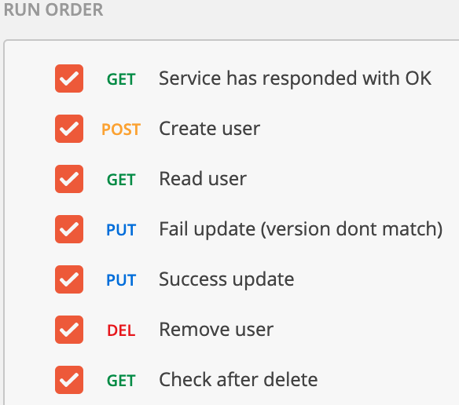
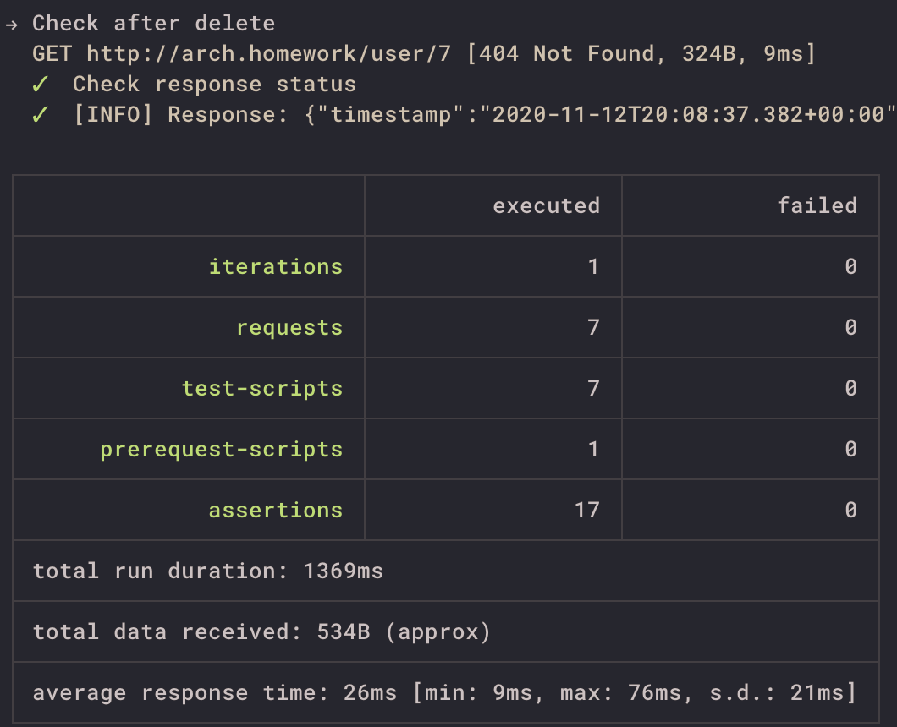

# otus-homework
## Идемпотетность и коммутативность API в HTTP и очередях
Создайте сервис "Заказ" (или используйте сервис из прошлого занятия) и для одного из его методов, например, "создание заказа" сделать идемпотетным.

На выходе должно быть:
0. описание того, какой паттерн для реализации идемпотентности использовался
1. команда установки приложения (из helm-а или из манифестов). Обязательно указать в каком namespace нужно устанавливать и команду создания namespace, если это важно для сервиса.
2. тесты в postman

#### Реализация
Для обеспечения идемпотентности была использована оптимистическая блокировка с использованием version.
Но, поскольку новую версия отправляется в базу вместе с query
```UPDATE User SET ..., version = version + 1 WHERE ID = ? AND version = ?```
то, я так же добавил ```Outbox```, реализованный на уровне триггеров в базе, чтобы обойти неприятности с
расследованием инцидентов, когда запросы в базу были отправлены "сбоку", без изменения вресии row.
```src/main/resources/sqlitesample.sql```

#### Запуск и тестирование
```
$ git clone --single-branch --branch HWA-07 https://github.com/turneps403/otus-homework.git HWA-07
$ cd HWA-07
$ cd helmfile
$ helmfile sync
... wait
$ cd -
$ newman run OTUS-HWA-07.postman_collection.json --global-var "baseUrl=arch.homework"
```



#### Curl'ing
```
curl -i -H "Content-Type: application/json" -X POST 'http://arch.homework/user/' --data '{"firstName":"Ivan", "lastName":"Foog", "email": "foo3@bar.baz"}'
curl -i -H "Content-Type: application/json" -X PUT 'http://arch.homework/user/1' --data '{"lastName":"FoogISH", "firstName":"Ivan", "email": "foo3@bar.baz", "ID":1, "version": 1}'
curl -i -H "Content-Type: application/json" -X GET 'http://arch.homework/user/1'
curl -i -H "Content-Type: application/json" -X DELETE 'http://arch.homework/user/1'
```

#### Ссылки, что так же помогли
* https://docs.spring.io/spring-framework/docs/2.5.x/reference/jdbc.html#jdbc-auto-genereted-keys
* https://stackoverflow.com/questions/24232892/spring-boot-and-sqlite
* https://www.udemy.com/course/hibernate-tutorial-advanced
* https://www.mysqltutorial.org/mysql-triggers/mysql-after-update-trigger/
* https://www.slideshare.net/Catabuke
