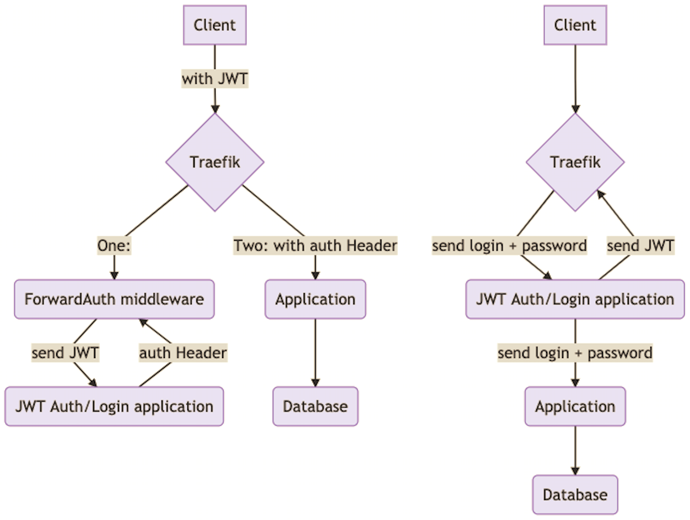
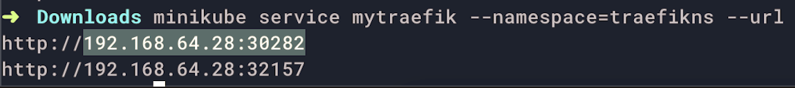
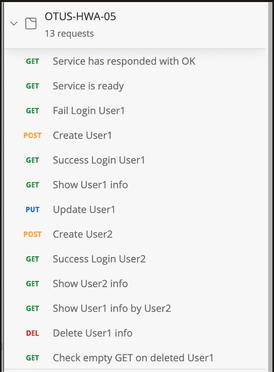
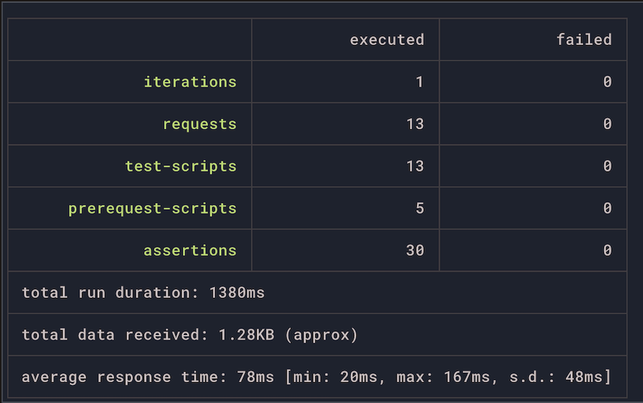

#### задание
**Backend for frontends. Apigateway**
Реализовать сценарий "Изменение и просмотр данных в профиле клиента".
Пользователь регистрируется. Заходит под собой и по определенному урлу получает данные о своем профиле. Может поменять данные в профиле. Данные профиля для чтения и редактирования не должны быть доступны другим клиентам (аутентифицированным или нет).

На выходе должны быть
1. описание архитектурного решения и схема взаимодействия сервисов (в виде картинки)
2. команда установки приложения (из helm-а или из манифестов). Обязательно указать в каком namespace нужно устанавливать.
* команда установки api-gateway, если он отличен от nginx-ingress.
3. тесты постмана, которые прогоняют сценарий:
* регистрация пользователя 1
* проверка, что изменение и получение профиля пользователя недоступно без логина
* вход пользователя 1
* изменение профиля пользователя 1
* проверка, что профиль поменялся
* выход* (если есть)
* регистрация пользователя 2
* вход пользователя 2
* проверка, что пользователь2 не имеет доступа на чтение и редактирование профиля пользователя1.

В тестах обязательно
* наличие {{baseUrl}} для урла
* использование домена arch.homework в качестве initial значения {{baseUrl}}
* использование сгенерированных случайно данных в сценарии
* отображение данных запроса и данных ответа при запуске из командной строки с помощью newman.

#### Решение
домашнее задание сделано на основе [предыдущего](https://github.com/turneps403/otus-homework/tree/HWA-03)

В качестве Api Gateway был выбран `Traefik` и, реализована аутентификация с помощью `JWT`.
Средством для перехвата трафика выбран middleware `ForwardAuth`, изолирующий знание
о механизме авторизации для основного приложения.

Traefik поднимается в отдельном неймспейсе и, работает с Service других неймсейсов через 
их описание с помощью External. Таким образом, встраивание Traefik происходит прозрачно.



#### мой доп github код для домашки
- [traefik + middleware](https://github.com/turneps403/helmfile-traefik-v2-minikube)
- [app for jwt](https://github.com/turneps403/java-crumbs/tree/jwt-middleware)

#### ньюансы
я так и не смог найти решения, как заэкспозить Traefik на minikube на 80 порт.
поэтому, прописать minikube ip в `/etc/hosts` не является решением.
в тестах Postman я учел эту особенность.

#### Запуск & Проверка
чекаутим проект
```
$ git clone --single-branch --branch HWA-05 https://github.com/turneps403/otus-homework.git HWA-05
$ cd HWA-05
``` 
запускаем Helm манифесты
```
$ cd cd hwHelmFile
$ helmfile sync
```
запрашивем у мини-кубика урлы для Traefik
```
$ minikube service mytraefik --namespace=traefikns --url
> http://192.168.64.28:30926
> http://192.168.64.28:32675
```

забираем ip и port для запуска тестов Postman
```
$ newman run OTUS-HWA-05.postman_collection.json --global-var "traefikMinikube=192.168.64.28:30282"
```


выключаем Helm манифесты
```
$ helmfile destroy
```

#### Curl'ing
```
curl -i -H "Content-Type: application/json" -X POST 'http://arch.homework:31373/cmd/user' --data '{"firstName":"Ivan", "lastName":"Foog"}'
curl -i -X GET 'http://arch.homework:31373/q/user?userID=3c024f13-c409-4bad-91f2-fe2a7276e8b1'
```


#### Knoweledge
* https://www.baeldung.com/cqrs-event-sourcing-java
* https://stackoverflow.com/questions/20096297/explicit-type-casting-example-in-java
* https://www.baeldung.com/spring-qualifier-annotation
* https://www.baeldung.com/spring-boot-h2-database
* https://www.baeldung.com/spring-boot-hibernate
* https://www.baeldung.com/spring-boot-hsqldb