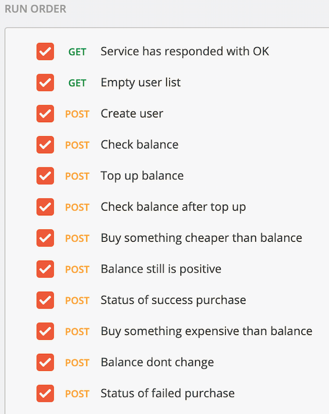

#### задание
**Stream processing**
**Реализовать сервис заказа. Сервис биллинга. Сервис нотификаций.**

При создании пользователя, необходимо создавать аккаунт в сервисе биллинга. В сервисе биллинга должна быть возможность положить деньги на аккаунт и снять деньги.

Пользователь может создать заказ. У заказа есть параметр - цена заказа.
Заказ происходит в 2 этапа:
1. сначала снимаем деньги с пользователя с помощью сервиса биллинга
2. отсылаем пользователю сообщение на почту с результатами оформления заказа. Если биллинг подтвердил платеж, должно отослаться письмо счастья. Если нет, то письмо горя.

#### Решение
Из-за ограничений по памяти, домашняя работа выполнена независимо от предыдущих работ.
По этой же причине, приложение запускается в одном Pod и, представляет из себя монолит без разбиения на модули.

За основу было взято описание [CQRS event sourcing](https://www.baeldung.com/cqrs-event-sourcing-java)

* В качестве Event store/propagation была выбрана ```Kafka```
* Projector применяет события к ```H2``` sql-like базе

Таким образом, реализуется ```eventual consistency``` 

#### Сложности
* большую часть времени съела сама разработка на spring

#### Tests



#### Запуск & Проверка
чекаутим проект
```
$ git clone --single-branch --branch HWA-06 https://github.com/turneps403/otus-homework.git HWA-06
$ cd HWA-05
``` 
запускаем Helm манифесты (не забываем про ```addon ingress```)
```
$ cd cd hwHelmFile
$ helmfile sync
... wait
$ cd -
$ newman run OTUS-HWA-06.postman_collection.json --global-var "ingressDomain=arch.homework"
```
выключаем Helm манифесты
```
$ helmfile destroy
```

#### Curl'ing
```
curl -i -H "Content-Type: application/json" -X POST 'http://arch.homework/cmd/user' --data '{"firstName":"Ivan", "lastName":"Foog"}'
curl -i -H "Content-Type: application/json" -X POST 'http://arch.homework/cmd/topup' --data '{"userID":"e9779fdc-01a2-4500-abf6-9584319694d0","amount": 20}'
curl -i -H "Content-Type: application/json" -X POST 'http://arch.homework/cmd/operation' --data '{"userID":"e9779fdc-01a2-4500-abf6-9584319694d0", "amount": 10, "operID": "fooBarOperID"}'

curl -i -H "Content-Type: application/json" -X POST 'http://arch.homework/q/bill' --data '{"userID":"e9779fdc-01a2-4500-abf6-9584319694d0"}'
curl -i -H "Content-Type: application/json" -X POST 'http://arch.homework/q/operations' --data '{"userID":"e9779fdc-01a2-4500-abf6-9584319694d0"}'
```

#### Knoweledge
* https://www.baeldung.com/cqrs-event-sourcing-java
* https://stackoverflow.com/questions/20096297/explicit-type-casting-example-in-java
* https://www.baeldung.com/spring-qualifier-annotation
* https://www.baeldung.com/spring-boot-h2-database
* https://www.baeldung.com/spring-boot-hibernate
* https://www.baeldung.com/spring-boot-hsqldb